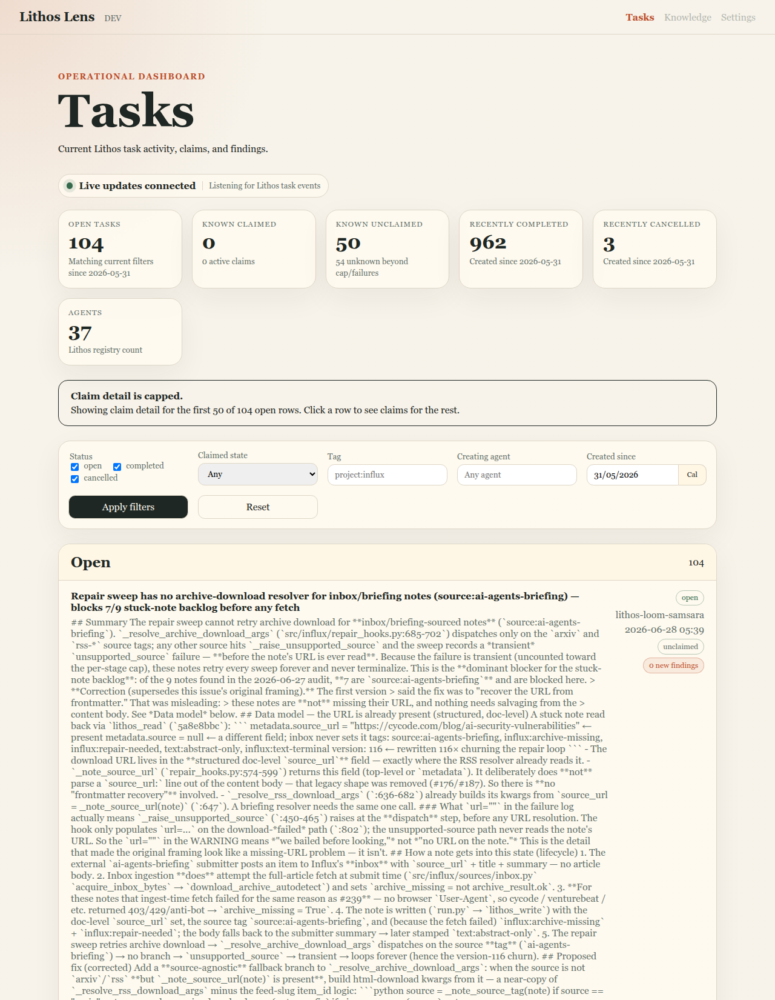
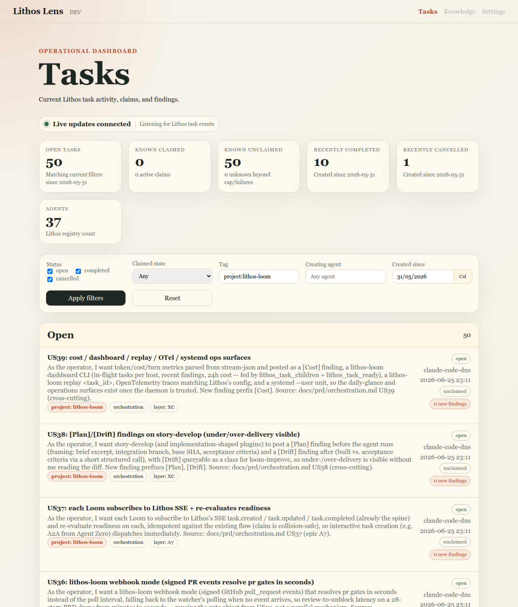
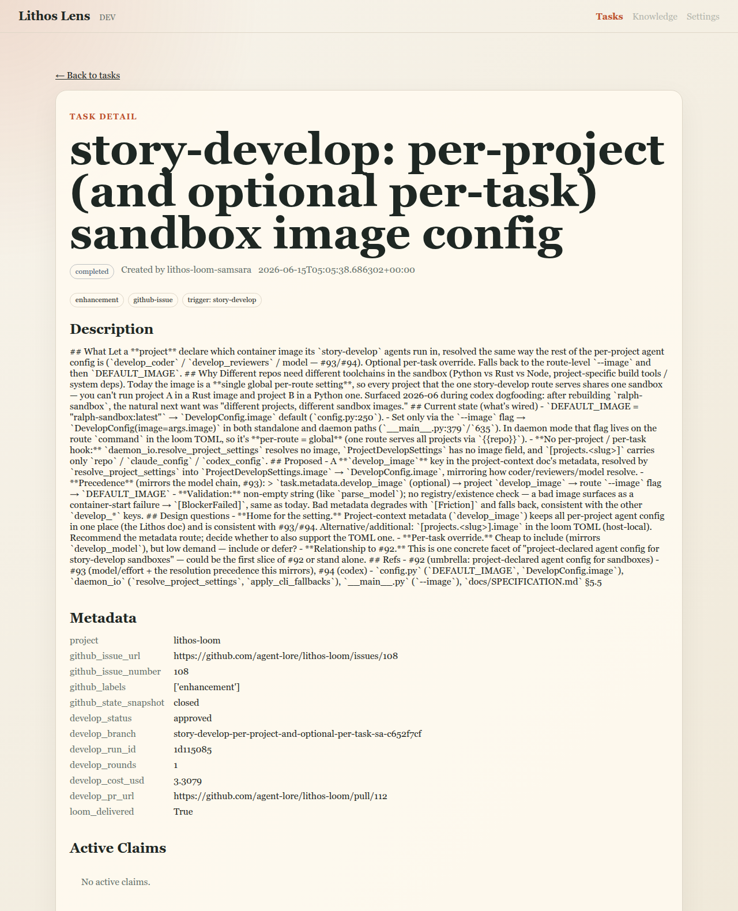
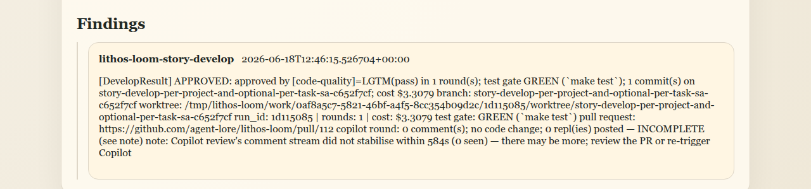
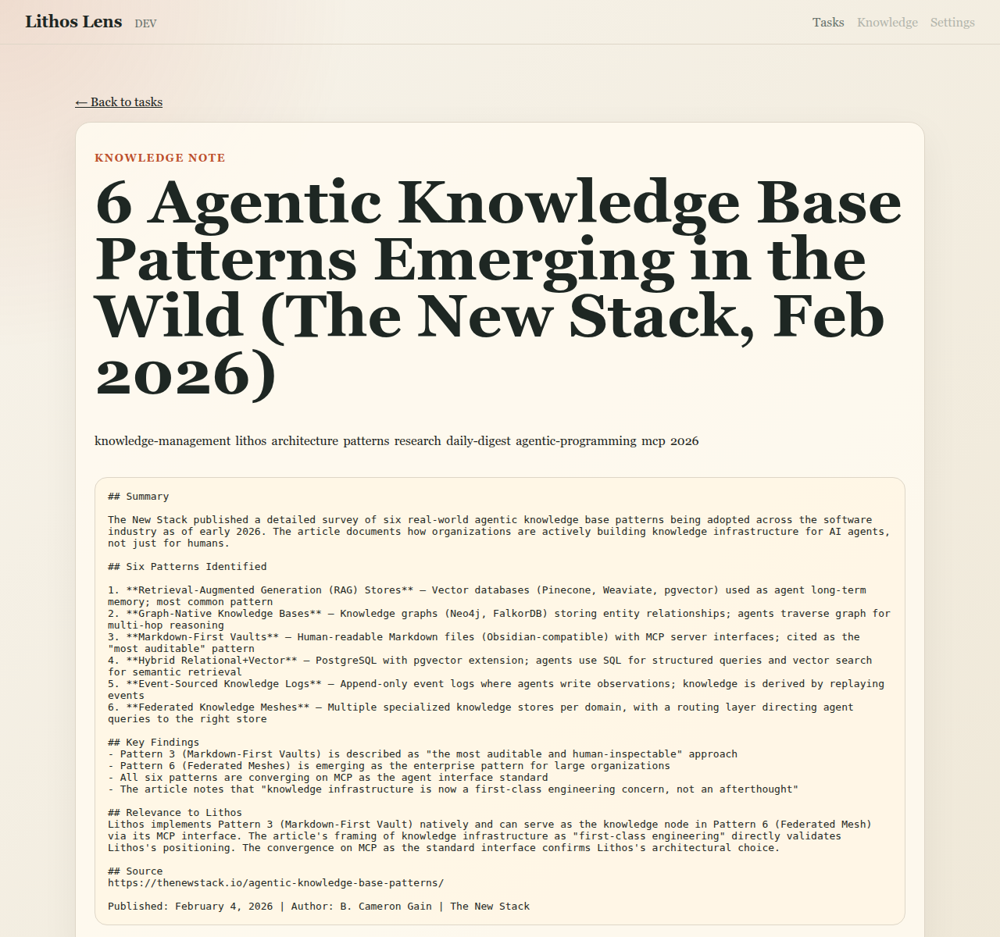

# Lithos Lens User Manual

Lithos Lens is a read-only window onto **Lithos** coordination state. Use it to watch the tasks agents are working on, drill into a single task, follow the findings agents post against it, and read the knowledge notes those findings link to. Lens never creates, claims, completes, or cancels anything — it only shows you what is in Lithos, and it updates live as things change.

_This file is regenerated by the `/regen-manual` slash command. Do not edit by hand — your changes will be overwritten on the next regeneration._

## Contents

- [Getting around](#getting-around)
- [The Tasks dashboard](#the-tasks-dashboard)
- [Task detail](#task-detail)
- [Finding timeline](#finding-timeline)
- [Knowledge notes](#knowledge-notes)
- [When Lithos is unavailable](#when-lithos-is-unavailable)

---

## Getting around

Every page shares the same slim header. On the left, **Lithos Lens** is the brand link — clicking it always returns you to the Tasks dashboard — and beside it a small badge shows the current environment (here, `DEV`). On the right is the primary navigation.

Only **Tasks** is active; it is highlighted when you are on the dashboard. The **Knowledge** and **Settings** links are placeholders for future milestones and are greyed out — you cannot click them yet. You still reach knowledge notes, just not from this menu: you follow a link from a finding (see [Knowledge notes](#knowledge-notes)). Just under the title, a **Live updates connected** indicator confirms Lens is receiving events from Lithos; when it is lit, the board refreshes itself as tasks change.

---

## The Tasks dashboard

The dashboard is the home page (both `/` and `/tasks` show it) and the heart of Lens: the operational view of every task Lithos knows about, grouped by status, annotated with who has claimed what, and updating live.

### Reading the board

Across the top, a row of summary cards gives you the shape of the workload at a glance: **Open tasks**, **Known claimed**, **Known unclaimed**, **Recently completed**, **Recently cancelled**, and the number of **Agents** registered with Lithos. The counts respect whatever filters you have applied.

Below the cards, you may see a **"Claim detail is capped"** notice. To stay fast, Lens enriches only the first batch of open rows with live claim detail (the cap is configurable). The notice tells you how many rows were enriched; to see claim detail for a task beyond the cap, open its detail page.

The tasks themselves are listed under their **status group** — **Open**, **Completed**, and **Cancelled** — each with a count beside the heading. Every row shows the task title, a short excerpt of its description, a status badge, the creating agent and when it was created, a claim badge (**unclaimed** or the claiming agent), and the task's **tag chips**. Click any row to open its [detail page](#task-detail). Because Lens is subscribed to Lithos events, rows appear, move between groups, and update their badges on their own — you do not need to refresh.

### Filtering what you see

The filter bar narrows the board:

- **Status** — tick **open**, **completed**, and/or **cancelled** to choose which groups are shown.
- **Claimed state** — limit to claimed or unclaimed tasks (or **Any**).
- **Tag** — type a tag (for example `project:lithos-loom`) to show only tasks carrying it. Clicking a tag chip on a row does the same thing.
- **Creating agent** — restrict to tasks created by one agent.
- **Created since** — set the start of the time window for completed and cancelled context.

Click **Apply filters** to update the board, or **Reset** to clear everything. Your current filter lives in the page's URL query string, so a filtered view is shareable, bookmarkable, and survives a refresh or a browser back/forward.

---

## Task detail

Click a task row on the dashboard to open its detail page. This is the full record for a single task.

The page leads with the task title and its status badge, followed by who created it and when, and its tag chips. The **Description** section renders the task's full brief. Below that, a **Metadata** table lists the task's structured fields — things like the project, the linked GitHub issue, the owning team, and timestamps. An **Active claims** section shows which agent (if any) currently holds the task, or "No active claims" when it is free. Continue down the page for the [finding timeline](#finding-timeline).

---

## Finding timeline

**Findings** are the notes agents post as they work a task — results, decisions, and problems. They appear as a timeline at the bottom of the task's detail page.

Each entry shows the agent that posted it and the timestamp, followed by the finding's summary. The timeline is ordered so you can read the task's history top to bottom. When a finding references a knowledge document, it includes a link — follow it to open that document in the [note renderer](#knowledge-notes). If Lithos is briefly unreachable, the section says findings are temporarily unavailable rather than showing stale data; refresh the task to retry.

---

## Knowledge notes

When a finding links to a knowledge document, clicking that link opens the note renderer.

The note page shows the document's title, its tags, and its content, with a **← Back to tasks** link to return to where you came from. Because you arrived from a finding, Lens keeps the originating task in context. This is a reading view onto Lithos knowledge — Lens displays the note, it does not let you edit it.

---

## When Lithos is unavailable

Lens depends on a Lithos server, but it is built to degrade gracefully rather than break. If its connection to Lithos is offline or unhealthy, Lens stays up and renders a clear degraded state: the dashboard explains that task data cannot be loaded, and detail, finding, and note views show a short "unavailable" message instead of erroring out. The **Live updates** indicator in the header also reflects the lost connection.

If you see this, the problem is almost always the Lithos server or the address Lens points at — not Lens itself. Check that your Lithos server is running and reachable, and that the `[lithos-lens.lithos] url` in your `lithos-lens.toml` points at it (see the project `README.md` for configuration). Once Lithos is healthy again, Lens reconnects and the board repopulates on its own.
