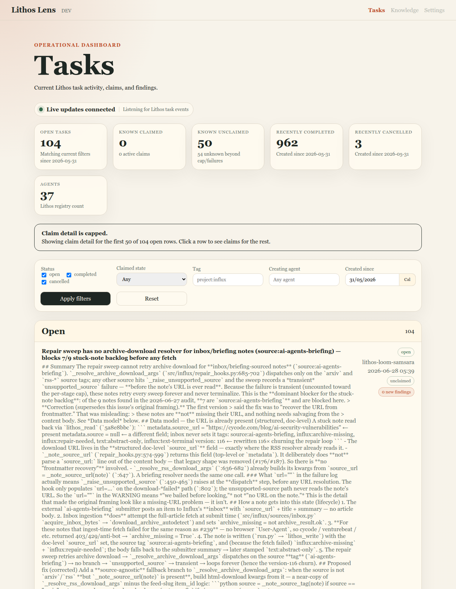
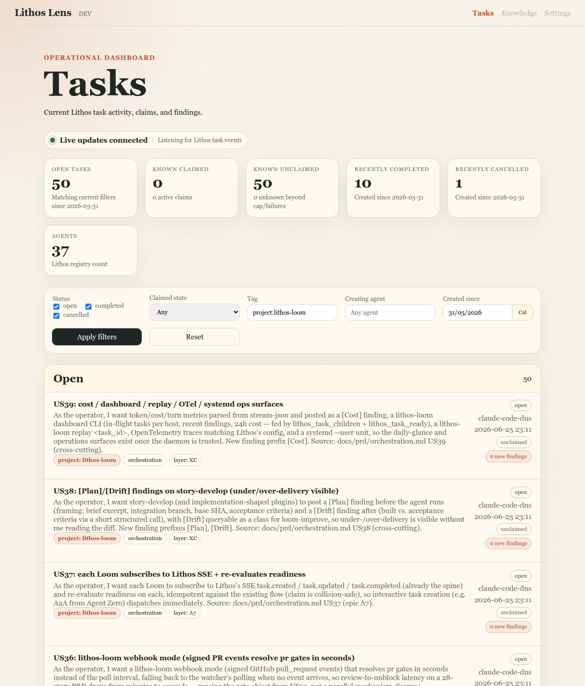
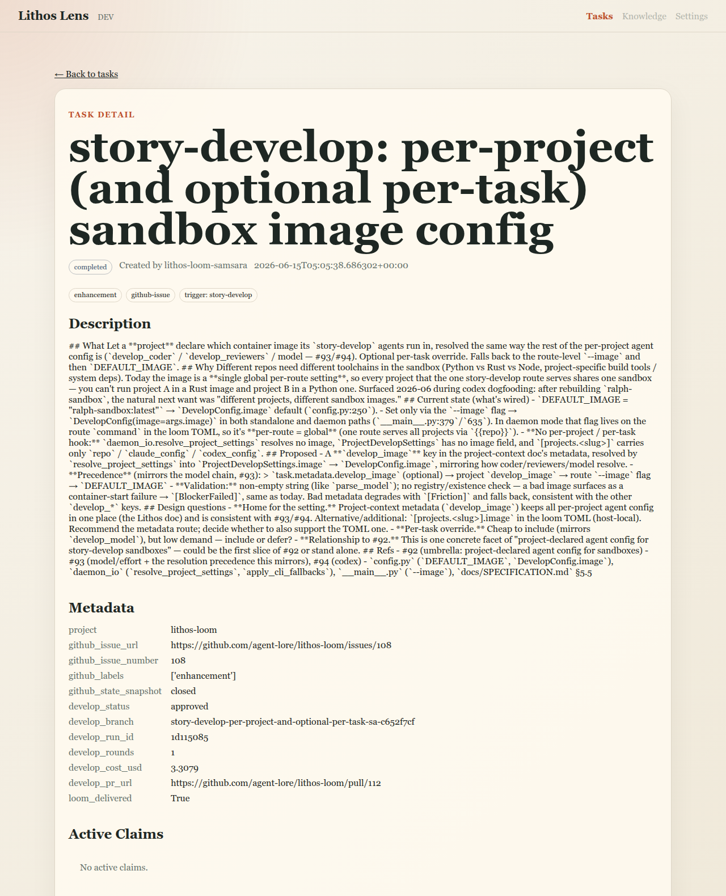
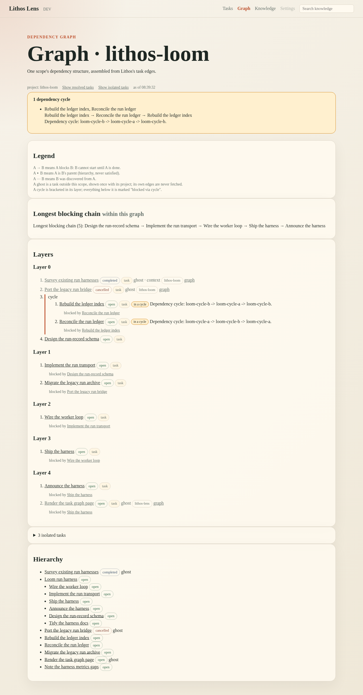
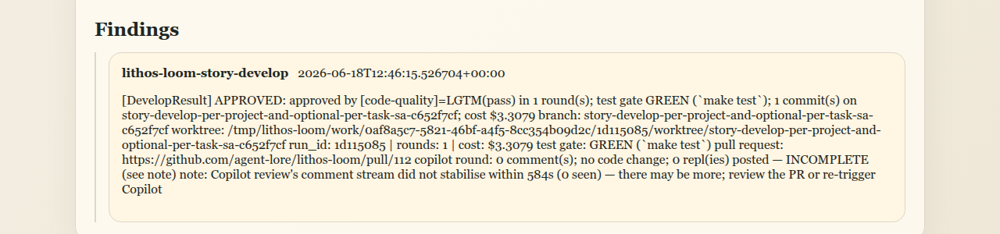
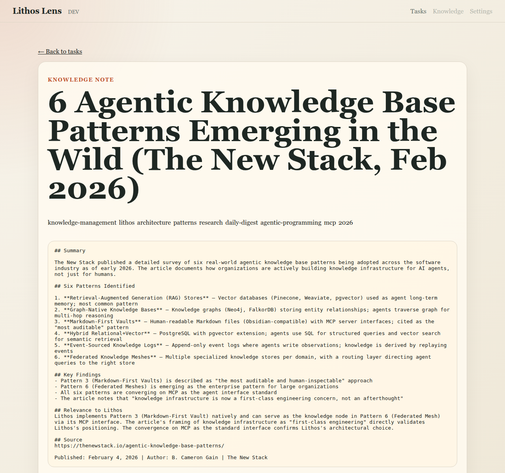

# Lithos Lens User Manual

Lithos Lens is a read-only window onto **Lithos** coordination state. Use it to watch the tasks agents are working on, drill into a single task, follow the findings agents post against it, and read the knowledge notes those findings link to. Lens never creates, claims, completes, or cancels anything — it only shows you what is in Lithos, and it updates live as things change.

_This file is regenerated by the `/regen-manual` slash command. Do not edit by hand — your changes will be overwritten on the next regeneration._

## Contents

- [Getting around](#getting-around)
- [The Tasks dashboard](#the-tasks-dashboard)
- [Task detail](#task-detail)
- [The task graph](#the-task-graph)
- [Finding timeline](#finding-timeline)
- [Knowledge notes](#knowledge-notes)
- [When Lithos is unavailable](#when-lithos-is-unavailable)

---

## Getting around

Every page shares the same slim header. On the left, **Lithos Lens** is the brand link — clicking it always returns you to the Tasks dashboard — and beside it a small badge shows the current environment (here, `DEV`). On the right is the primary navigation.

**Tasks**, **Graph** and **Knowledge** are all live, and the one you are on is highlighted. **Settings** is a placeholder for a future milestone and is greyed out — you cannot click it yet. Beside the links, a search box takes you straight to knowledge search. Just under the title, a **Live updates connected** indicator confirms Lens is receiving events from Lithos; when it is lit, the board refreshes itself as tasks change.

---

## The Tasks dashboard

The dashboard is the home page (both `/` and `/tasks` show it) and the heart of Lens: the operational view of every task Lithos knows about, grouped by status, annotated with who has claimed what, and updating live.

### Reading the board

Across the top, a row of summary cards gives you the shape of the workload at a glance: **Open tasks**, **Known claimed**, **Known unclaimed**, **Recently completed**, **Recently cancelled**, and the number of **Agents** registered with Lithos. The counts respect whatever filters you have applied.

Below the cards, you may see a **"Claim detail is capped"** notice. To stay fast, Lens enriches only the first batch of open rows with live claim detail (the cap is configurable). The notice tells you how many rows were enriched; to see claim detail for a task beyond the cap, open its detail page.

The tasks themselves are listed under their **status group** — **Open**, **Completed**, and **Cancelled** — each with a count beside the heading. Every row shows the task title, a short excerpt of its description, a status badge, the creating agent and when it was created, a claim badge (**unclaimed** or the claiming agent), and the task's **tag chips**. Click any row to open its [detail page](#task-detail). Because Lens is subscribed to Lithos events, rows appear, move between groups, and update their badges on their own — you do not need to refresh.

### Filtering what you see

The filter bar narrows the board:

- **Status** — tick **open**, **completed**, and/or **cancelled** to choose which groups are shown.
- **Claimed state** — limit to claimed or unclaimed tasks (or **Any**).
- **Tag** — type a tag (for example `project:lithos-loom`) to show only tasks carrying it. Clicking a tag chip on a row does the same thing.
- **Creating agent** — restrict to tasks created by one agent.
- **Created since** — set the start of the time window for completed and cancelled context.

Click **Apply filters** to update the board, or **Reset** to clear everything. Your current filter lives in the page's URL query string, so a filtered view is shareable, bookmarkable, and survives a refresh or a browser back/forward.

---

## Task detail

Click a task row on the dashboard to open its detail page. This is the full record for a single task.

The page leads with the task title and its status badge, followed by who created it and when, and its tag chips. The **Description** section renders the task's full brief. Below that, a **Metadata** table lists the task's structured fields — things like the project, the linked GitHub issue, the owning team, and timestamps. An **Active claims** section shows which agent (if any) currently holds the task, or "No active claims" when it is free. Continue down the page for the [finding timeline](#finding-timeline).

---

## The task graph

**Graph** in the header opens `/tasks/graph`: the dependency structure of one project or one epic, rather than a list of rows. Open it with no scope and Lens shows a picker — every project it can see in the current snapshot, and every open epic. Pick one and you get that scope's graph.

Read the page top to bottom; it is written in that order on purpose.

- **Dependency cycles** come first, in a warning panel. A cycle is a loop in the dependency structure: work that, as planned, waits on itself. The panel shows the loop; whether a particular task is *blocked right now* is Lithos's call, not a shape Lens read — so the rows that Lithos reports as cycle-blocked are the ones carrying an **in a cycle** marker with Lithos's own message. (A loop whose edges are already satisfied — a completed task still pointing at an open one — is drawn as history and need not be stopping anything.) Work sitting downstream of the loop in the same structure is marked *blocked via cycle* in the layers below. When the edges Lens fetched show the loop, the panel also names its members and one representative path around it. When they do not, the cycle is still named, with Lithos's own explanation: under *through tasks outside this scope* if the task Lithos names as the blocker is outside this graph, and under *shape unavailable* otherwise — which says only that these edges do not show the loop, not where it runs.
- **The legend** spells out what each kind of line means in words ("A → B means A blocks B"), plus the two conventions the page uses: a *ghost* is a task outside this scope, and a cycle these edges show is bracketed in its layer (one they do not show is named in the callout instead).
- **The longest blocking chain** is the longest run of work that has to happen in order *within this graph*. It is the sequence to read the rest of the page along. It is not a claim about your whole corpus, and it says so.
- **Layers** are the graph itself, arranged by **dependency depth**. A cycle counts as a single group here — its members are bracketed together and placed as one — and layer 0 holds the groups that nothing *else* in the graph points at; each layer below has a chain of that many dependencies behind it in the picture. So layer 0 does not mean "ready": a cycle sits there whenever nothing outside it blocks it, even though its members are waiting on each other, which is exactly what the screenshot above shows. Nor is the depth a start signal — the layers are drawn over every dependency edge the page fetched, satisfied ones included, so a layer does not have to finish before the next one begins. Whether one task can start is its own question: read the **blocked by** lines under its row, the *ready* / *blocked* sections on the [dashboard](#the-tasks-dashboard), or the task's own detail page. Every row carries the task's status, its type, who has claimed it, and — under it — what it is blocked by. A row for a task outside this scope is dimmed, carries its own project chip, and offers a link to *that* project's graph, so crossing a project boundary is something you choose rather than something that happens to you.
- **N isolated tasks** folds away the tasks in this scope with no dependency edges at all. On a project graph it starts collapsed (they are not part of the structure you came to read); on an epic graph it starts open, because an epic's progress includes its edge-less children. The **Show isolated tasks** link in the toolbar flips it.
- **Hierarchy** is the parent/child tree for the same scope — the epic-and-children view, independent of what blocks what.

Two toolbar controls change what the scope contains. **Show resolved tasks** brings finished work back into the picture; on an epic graph, closed children are shown by default and this hides them instead. The **as of** time is when the underlying edges were read — Lithos does not notify Lens when an agent adds a dependency, so this is how fresh the picture is, stated rather than implied.

Lens is honest about what it could not read. If a task's edges could not be fetched it is marked **edges unknown** and is never quietly filed as "isolated"; if a blocker's status could not be read, its dependent is marked **blocked by unresolvable predecessor**; and when either happens, the longest chain is written as "≥ N" with a note, because the real chain can only be longer. If the read behind the cycle panel was cut short or failed, a banner says so and the affected tasks read **cycle status unknown** — never a silent "no cycle".

A very large scope is refused rather than drawn unreadably: Lens shows a **Narrow your scope** panel with the count it found and the limit, and invites you to pick a single epic or a smaller project.

---

## Finding timeline

**Findings** are the notes agents post as they work a task — results, decisions, and problems. They appear as a timeline at the bottom of the task's detail page.

Each entry shows the agent that posted it and the timestamp, followed by the finding's summary. The timeline is ordered so you can read the task's history top to bottom. When a finding references a knowledge document, it includes a link — follow it to open that document in the [note renderer](#knowledge-notes). If Lithos is briefly unreachable, the section says findings are temporarily unavailable rather than showing stale data; refresh the task to retry.

---

## Knowledge notes

When a finding links to a knowledge document, clicking that link opens the note renderer.

The note page shows the document's title, its tags, and its content, with a **← Back to tasks** link to return to where you came from. Because you arrived from a finding, Lens keeps the originating task in context. This is a reading view onto Lithos knowledge — Lens displays the note, it does not let you edit it.

---

## When Lithos is unavailable

Lens depends on a Lithos server, but it is built to degrade gracefully rather than break. If its connection to Lithos is offline or unhealthy, Lens stays up and renders a clear degraded state: the dashboard explains that task data cannot be loaded, and detail, finding, and note views show a short "unavailable" message instead of erroring out. The **Live updates** indicator in the header also reflects the lost connection.

If you see this, the problem is almost always the Lithos server or the address Lens points at — not Lens itself. Check that your Lithos server is running and reachable, and that the `[lithos-lens.lithos] url` in your `lithos-lens.toml` points at it (see the project `README.md` for configuration). Once Lithos is healthy again, Lens reconnects and the board repopulates on its own.
